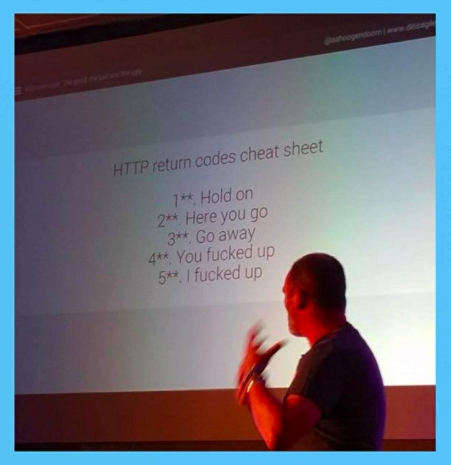

# Flutter weather app

Simple flutter weather app.

## What did I learn on this project?

- asynchronous programming

    Some times, some works take more time to be done! like loading a large image from the internet. if we want to be able do more works while a working being done we could use asynchronous programming.

- Duration and sleep function

- Future, async, await;

- Exception handling in dart

    It is so similar to exception hanling in java. we use try, catch block.

- Null aware operator

    ```
    double myValue;

    use(myValue ?? 20.0);
    ```
    this means if myValue is null then use 20.0 as a parameter!

- using APIs in dart

    
    Oh god I lave the way that Angela explain things =))))

- handy cookbook about fetching data from the internet! [this link](https://flutter.dev/docs/cookbook/networking/fetch-data)

- HTTP status code!

    
    
    Oh god I lave the way that Angela explain things =))))

- Work with JSON responses in dart! 

    In [this link](https://flutter.dev/docs/development/data-and-backend/json) you can find some good resourses about json string and use those strings in dart!
